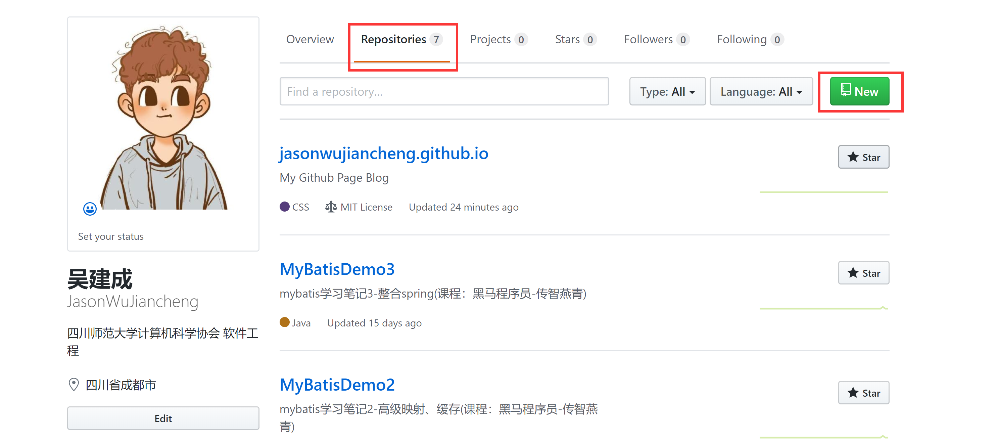
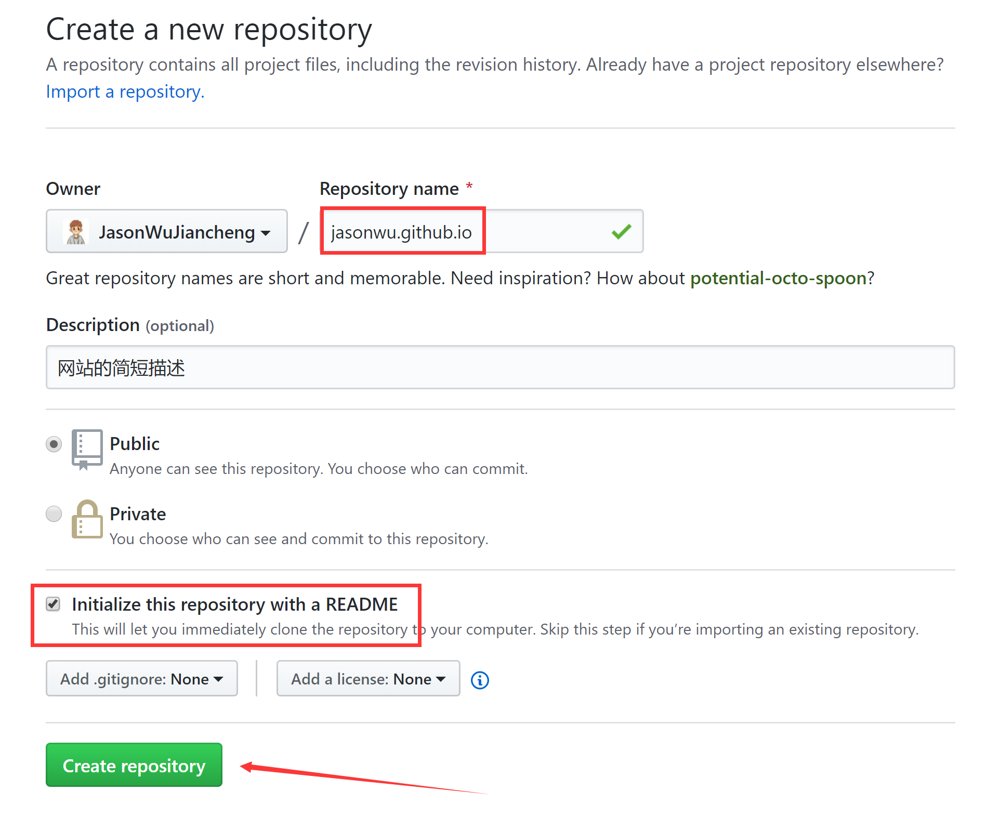
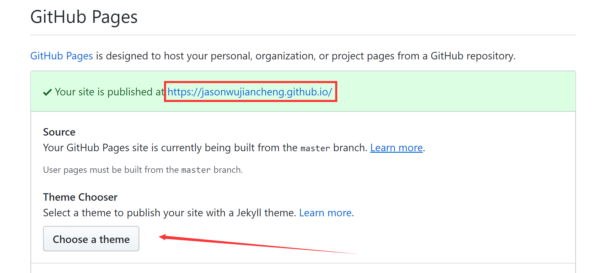
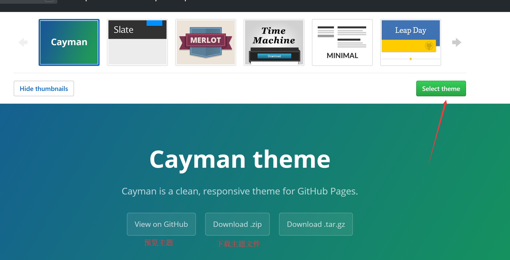

[TOC]
> 在这知识剧烈膨胀的时代，如何记录、整理、分享自己的所学所感无疑显得十分重要，而博客便是最好的方式之一。其实早就有建立一个个人博客的想法，但由于各种原因一直在推迟，建立了自己的博客，但是迟迟也没有更新什么，索性就说说利用*github page*建站的事情吧。

# GitHub Page建站

> *github.io*默认采用[Jekyll](https://www.jekyll.com.cn/)作为建站工具，而后者是一款当前火热的开源静态网站建站工具，拥有庞大的使用群体和社区。意味着其拥有丰富的插件，丰富的主题，最重要的是已经有无数人帮你造出了无数的轮子可供参考。没有前端功底？没关系，可以直接从其他大佬的[github](http://github.com/)里直接*Fork*一套框架就行了。

## 1、主要步骤

- 创建一个github的账号

- 在个人主页中新建一个库

1. 进入**个人主页**，并在**Repositories**中点击**New**新建一个库

2. 库的名字前缀==一定==要和个人主页名一样，如：个人主页网址为https://github.com/JasonWu，则库名应该为jasonwu.github.io

3. 进入**设置页面**，并设置page

往下翻找到==GitHub Pages==

这里红框中显示的就是你的博客地址

4. 选择主题

> 至此你的*github page*已经简单搭建起来了，如果想详细了解如何将本地文件与网站相连，需要了解*git*相关知识。接下来我将简单介绍一下fork下来的别人的主题，如何进行简单配置。

## 2、目录结构
可以看到从网上fork下来的网站的目录是这样的，做参考使用。

**下面列举重要的两件事**

1. 修改博客信息
2. 发布博文

## 3、修改博客信息

更改目录树下的`_config.yml`文件即可

## 4、发布博文

将博文内容保存为一定格式的`.md`文件并放入目录树`_posts`文件夹下即可

> 注:修改文件后记得进行*git commit*提交，并*git push*更新至服务器

## 5、关于markdown

[什么是markdown?](https://baike.baidu.com/item/markdown/3245829?fr=aladdin)

因为博主之前有写过html+css之类的文本标记类的语言，所以学习`markdown`很快，如果之前没接触过这类的语言建议先学习。值得一提的是md确实很简单，所以不用紧张。

文档当作字典来查就好了：[markdown中文文档](http://www.markdown.cn/)

## 6、总结

总的来说，利用`GitHub Page`建站还是对使用者有一定的要求：

- 必须得有基本的**git**使用基础
- 必须对**前端**有一定概念
- 必须较为熟悉**Markdown**的撰写

这里附上我用到的工具：

1. [Typora](https://www.typora.io/) ：一款简单的markdown编辑器，所见即所得
2. [VSCode](https://code.visualstudio.com/) ：用这个软件来编写你的本地代码以及关联git进行版本控制
3. [Git](https://git-scm.com/downloads) ：版本控制软件